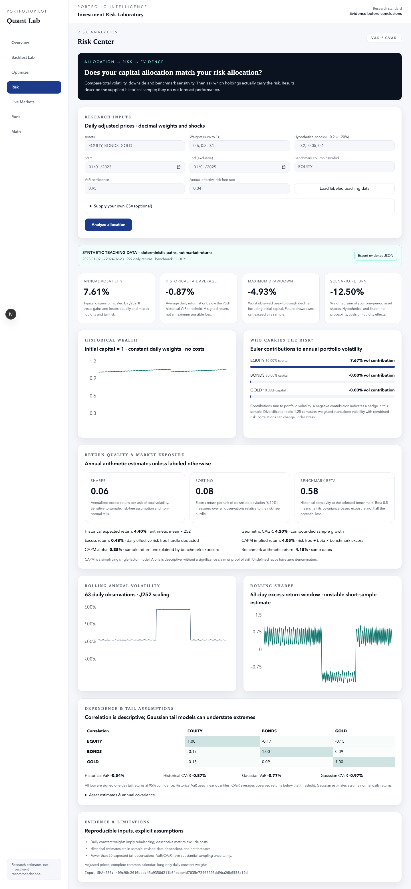

# PortfolioPilot

**Capital weights tell you where money sits. Risk contributions tell you what can move it.**

PortfolioPilot is an investment-risk laboratory for investigating whether an allocation's
apparent diversification survives a closer look at covariance, downside and benchmark exposure.
The goal is to understand a portfolio, not to turn a historical Sharpe ratio into a trading promise.



## The financial question

A portfolio with 60% in equities does not necessarily obtain 60% of its risk from equities.
Volatility depends on each holding's own dispersion **and its covariance with the other holdings**.
PortfolioPilot connects those relationships to an interactive workflow: supply prices, choose
weights, examine who carries the risk, and challenge the allocation with hypothetical asset shocks.

## Why this exists

Diversification is an economic relationship, not a count of ticker symbols. I wanted a system
that makes the difference between capital allocation and risk allocation inspectable, while
keeping the uncertainty in historical estimates visible. The lab combines portfolio mathematics
with strict data contracts, numerical tests and an interface that explains what each estimate means.

## What you can investigate

- **Allocation diagnosis:** individual and portfolio return estimates, annual volatility,
  excess return, geometric CAGR, Sharpe, Sortino, downside deviation and maximum drawdown.
- **Tail behavior:** historical and Gaussian one-day VaR/CVaR, with signed-return conventions
  and warnings about thin tail samples.
- **Dependence:** covariance, correlation, Euler volatility contribution, diversification ratio,
  benchmark beta, descriptive CAPM return and alpha, and rolling metrics.
- **Scenario analysis:** user-specified per-asset shocks and their weighted portfolio impact.
- **Construction:** mean-variance/tangency, target-return efficient frontier, equal risk
  contribution and CVaR minimization. Infeasible requests produce errors.
- **Historical strategies:** buy-and-hold, periodic equal weighting, momentum 12–1, minimum
  variance, risk parity, CVaR and unlevered volatility targeting, with warm-up, drift and costs.
- **Evidence:** input source, dates, observation counts, assumptions and a canonical price-panel
  SHA-256 hash in downloadable risk JSON. Supplied CSV needs no market-data credentials.

Existing Finnhub monitoring, Fama–French regression API and saved-run infrastructure are preserved.
Live monitoring requires Finnhub and Redis; absent credentials no longer generate fake quotes.
The FRED adapter is optional infrastructure, not an automatic risk-free input to the dashboard.

## An example of financial reasoning

The **explicitly selected synthetic teaching fixture** currently produces 7.61% annual portfolio
volatility. Its 60% equity allocation contributes approximately 7.67 percentage points, while
bonds and gold have small negative contributions in this constructed sample. The lesson is
that a hedge can reduce total volatility even though it has positive standalone volatility.
These are actual calculations on deterministic teaching paths, **not observed market performance**.
Changing weights, source data or shocks recomputes the output. The screenshot shows that fixture.

## Financial framework

For daily simple asset returns `r`, weights `w`, and annualized sample covariance `Σ`:

`portfolio return = wᵀr` · `portfolio volatility = √(wᵀΣw)`

`asset i volatility contribution = wᵢ(Σw)ᵢ / portfolio volatility`

Contributions sum to total portfolio volatility. Sharpe measures excess return per unit of
volatility; Sortino uses the lower partial second moment relative to the risk-free hurdle.
CAPM explains historical return in terms of benchmark exposure, with no assertion of stable beta
or statistically significant alpha. See [methodology](docs/METHODOLOGY.md) for exact conventions.

## Run the lab

Use **Node 24**, **pnpm 11.19.0**, **Python 3.12** and Redis for the Express gateway.
PostgreSQL is required only for saved-run persistence. No keys are needed for supplied-price risk.

```bash
pnpm install --frozen-lockfile
pnpm --filter @portfoliopilot/api prisma:generate
python3.12 -m venv .venv
.venv/bin/python -m pip install --upgrade pip
.venv/bin/python -m pip install -r services/quant/requirements.lock -e 'services/quant[dev]'
```

Start each service in its own terminal from the repository root:

```bash
redis-server --bind 127.0.0.1 --port 6379
.venv/bin/python -m uvicorn app.main:app --app-dir services/quant --port 8000
pnpm --filter @portfoliopilot/api dev
pnpm --filter @portfoliopilot/web dev
```

Open [the risk workbench](http://localhost:3000/risk), select **Load labeled teaching data**, then
**Analyze allocation**. Or upload your own CSV with a `date,SYMBOL,...` header, complete daily
adjusted prices and a benchmark column. Weights and shocks are decimals; `-0.2` means a 20% fall.
CSV prices must be finite and positive, dates chronological, and weights sum to one.
The source field is a user assertion; the application cannot audit whether an uploaded series
is actually adjusted or point-in-time.

For saved runs, supply `DATABASE_URL`, start PostgreSQL, then run
`pnpm --filter @portfoliopilot/api exec prisma db push`. The API uses environment variables;
copy `.env.example` into `services/api/.env` when using package-specific commands. Put the web
URL in `apps/web/.env.local` if it differs from the default. Export `QUANT_FRED_API_KEY` only if
using the optional FRED adapter. Docker definitions remain in `infra/` as an alternative.

## Validation

```bash
pnpm lint
pnpm typecheck
pnpm test
pnpm build
.venv/bin/python -m ruff check services/quant/app services/quant/tests
.venv/bin/python -m pytest services/quant/tests -q
pnpm audit --audit-level=low
```

Tests cover hand-calculated volatility, beta, CVaR, downside deviation and drawdown; contribution
identities; invalid and unavailable data; cost/drift accounting; future-price perturbations;
annualization; infeasible optimizers and equal-risk solutions; CSV parsing and shared schemas.
[Delivery evidence](docs/PORTFOLIO_DELIVERY.md) records exact observed checks and independent review.

## Assumptions and limitations

Daily annualization uses 252 periods. Risk snapshots assume constant daily weights and exclude
trading costs; the backtest uses a separate holdings-based accounting model. Tail estimates have
sampling error, normality is a simplifying assumption, beta is unstable, and correlations can
rise in crises. Adjusted prices may be revised; a user-selected universe can create survivorship
bias. Optimizations are in-sample and are not evidence of out-of-sample skill. Backtests use a
simplified close-to-next-close execution convention and linear costs; no market impact, taxes,
financing, exchange calendars or executable close-auction modeling is supplied. This unauthenticated
research application is designed for local use. See [limits](docs/LIMITATIONS.md).

## Architecture and further research

Next.js → typed shared schemas → Express gateway → FastAPI domain modules. Redis caches quotes;
Prisma/PostgreSQL and local JSON preserve runs. Risk calculations are deterministic and contain
no language-model generated numbers. [Architecture](docs/ARCHITECTURE.md) ·
[data dictionary](docs/DATA_DICTIONARY.md) · [model card](docs/MODEL_CARD.md).

Future research includes point-in-time universe membership, calendar-aware data quality checks,
bootstrap uncertainty bands, regime-conditioned covariance, robust/shrinkage optimization and
walk-forward allocation evaluation. These are research directions, not completed capabilities.
